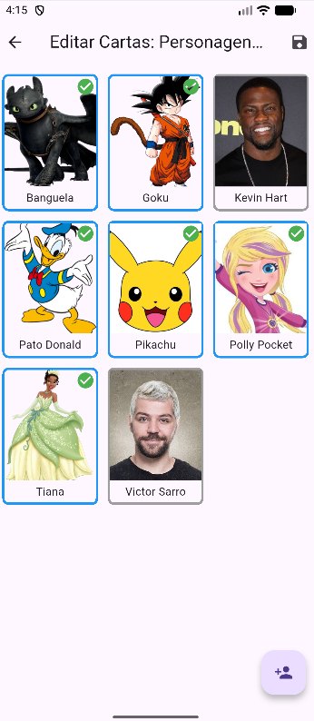
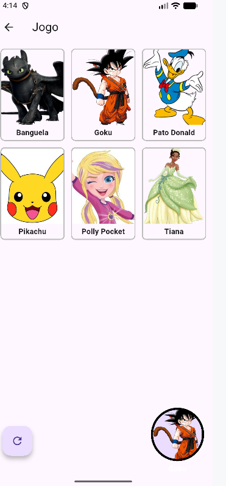

# 🎮 Guess Who (Flutter)

**Guess Who** is a **mobile game** developed with **Flutter**, focused on **local multiplayer experiences**.  
The game allows **nearby players** to connect directly to each other using **Nearby Connections**, with all player data stored locally via **Isar Database**.

---

### 📱 About the Project

**Guess Who** is a **head-to-head multiplayer game** where players can **create, manage, and play with custom decks of cards**.  

The gameplay works as follows:
1. **Create Cards** – Players first register individual cards in the system.
2. **Build Decks** – Cards are assigned to decks. You can create multiple decks using the same or different cards.
3. **Deck Reuse** – Cards only need to be registered once and can be reused in multiple decks.
4. **Start a Game** – The host selects a prepared deck and waits for a client to connect.
5. **Automatic Deck Sharing** – The chosen deck is sent to the client device, which **does not need to have the cards or deck registered locally**.

The project emphasizes:
- Flexible deck and card management
- Local multiplayer gameplay
- Real-time peer-to-peer communication
- Efficient local data storage

---

### 🚀 Features

- 👥 **Head-to-Head Multiplayer**  
  Play against another person using nearby device connections.

- 📡 **Nearby Device Discovery & Communication**  
  Uses `nearby_connections` to discover devices, establish connections, and exchange game data in real time.

- 🗄️ **Local Persistence with Isar**  
  Player profiles and match data are stored locally using the **Isar Database**.

- ⚡ **Offline-First Experience**  
  Fully functional without internet access.

---

### 🛠️ Technologies & Tools

#### Mobile
- **Flutter**
- **Dart**

#### Data & Connectivity
- **Isar Database**
- **Nearby Connections**

#### Architecture
- Offline-first design  
- Peer-to-peer communication  
- Modular and scalable structure  

---

### 🖼️ Screenshots

<p align="center">
  
  
</p>

---

### 📂 Project Structure (Simplified)

```text
lib/
 ├── models/        # Isar entities (Cards, Decks)
 ├── pages/         # Application screens and navigation
 ├── services/      # Database (Isar) and Nearby Connections logic
 └── widgets/       # Reusable UI components
```

 ### 🔮 Future Work / Next Steps

The following improvements and features are planned for **Guess Who**:

- 🎨 **Improved UI/UX**  
  Refine the game interface, animations, and feedback to make gameplay more engaging.

- 🧩 **Game Modes & Variants**  
  Add new gameplay modes, challenges, etc.

- 📊 **Statistics & Leaderboards**  
  Track player performance, win/loss ratios, and match history locally.

- 🔒 **Data Security & Synchronization**  
  Implement optional encrypted storage and offline-to-online sync for future cloud integration.

- ⚡ **Performance Optimizations**  
  Reduce latency in real-time communication and improve responsiveness on low-end devices.